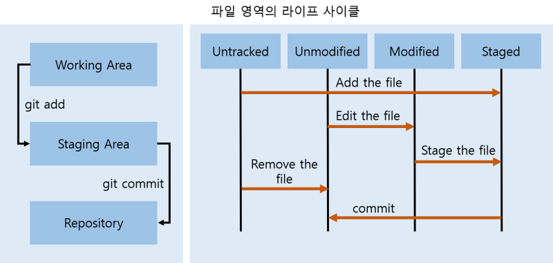

# GitHub 원격 저장소 동기화 및 코드 올리기

> 그냥 원격 저장소를 추가하고 pull할 수도 있고, 아예 한번에 원격 저장소의 내용을 복사해올 수도 있습니다.
> 전자는 #1A를, 후자는 #1B를 보면 됩니다.  #2부턴 동일합니다. 
> 만약 브랜치를 새로 생성하여 작업하고 싶다면 다음 포스팅을 참고하세요.
> 여기서는 브랜치를 생성하지 않고 그냥 작업, push합니다.​

## 0. 먼저 원하는 디렉토리(올리고 싶은 파일이 있는 폴더)에서 오른쪽 마우스 - git bash here을 클릭해줍니다. 


> 원격 저장소의 주소는 github에서 원하는 project에서 clone 혹은 code 버튼을 누르고 https 주소 복사 버튼을 누르면 됩니다.  
> origin은 원격 저장소의 이름이 될 것이고, 다른 것으로 설정하고 싶다면 다른 것으로 설정해주어도 됩니다.

```
$git remote add origin 원격저장소주소
```
> git bash에선 컨트롤+v 대신 오른쪽마우스-paste로 붙여넣기를 할 수 있습니다.
> 저장소 이름과 주소를 보고 싶다면 다음을 입력하세요.

```
$git remote -v
```

## 1_A3 원격저장소의 내용과 로컬 저장소의 내용을 동기화합니다.

​```
$git pull origin 브랜치이름
```
​```
git pull origin master 이런 식으로 작성하면 됩니다.
```

pull은 원격 저장소에서 로컬 저장소로 data를 가져오고 로컬 데이터와 병합까지 해주는 작업입니다. 바로 ## 2로 넘어가면 됩니다.
## 1_B 원격 저장소의 내용을 복사해오고자 할 때 다음을 입력해 줍니다.

```
$git clone 원격저장소주소
```
그러면 해당 디렉토리에 원격 저장소의 이름으로 폴더가 하나 생성된 것을 볼 수 있습니다. 그러면 그 폴더 안으로 들어가줘야 합니다.

```
$cd 폴더이름
```

## 2 이제 원격 저장소에서 받아온 내용들을 수정해주거나 파일을 추가해 줍니다. 만약 여기서 브랜치를 새로 생성하여 작업하고 싶다면 다음 포스팅을 참고하세요. 여기서는 브랜치를 생성하지 않고 그냥 작업, push합니다.
​

## 3 수정이 끝났다면 로컬저장소에 파일들을 올려줍시다. 모든 파일을 다 올릴려면 파일명혹은폴더명 위치에 .이 오면 됩니다.
```
$git add 파일명혹은폴더명
```

## 4 그 다음엔 commit 합니다. commit은 로컬 저장소에 변경 내역(add된 파일들)을 반영하는 작업입니다. push 메시지는 원격 저장소에 commit된 내용 반영할 때 입력되는 메시지를 말합니다. 
```
$git commit -m "push메시지"
```​

## 5 이제 commit된 내용을 원격 저장소에 반영합시다. push를 이용하여 하면 됩니다. (push 하기 전에 pull해서 확인하는 것이 좋다고 합니다. 그 내용은 ## 6~#8 입니다.) 
```
$git push origin 브랜치이름
```
git push origin master 이렇게 작성하면 됩니다. 성공적으로 잘 되었다면 원격 저장소로 가서 한번 확인해 봅니다.

이때 원격 저장소의 내용이 변경되어 거절되는 경우가 있습니다. 그럴 경우에는 #6을 보면 됩니다.
​

#6 다시 원격 저장소에서 로컬 저장소로 data를 가져와 줍니다.
$git pull origin 브랜치이름

#7 충돌이 발생한 부분을 체크하고 충돌이 발생한 파일을 수정해 줍니다.

```
$git diff
```
#8 수정한 파일을 add, commit, push 합니다.

```
$git add 수정한파일
$git commit -m "push메시지"
$git push origin 브랜치이름
```

> 파일 영역의 라이프 사이클, add와 commit, push



#1 왼쪽에 working area, staging area, repository는 파일들이 저장되는 장소입니다.

working area(working directory)는 현재 눈에 보이는 디렉토리입니다. 뒤에 branch 설명에 나오겠지만, 특정 버전에 checkout한 상태라고 합니다.

staging area는 local repository에 올리기 전에 원하는 파일들을 선택하여 스냅샷을 만들고 담아두는 곳입니다. 

위 사진에서 repository는 local repository를 말합니다. 원격 저장소로 올리기 전, 로컬에서 마지막으로 저장되는 곳입니다.
​

#2 오른쪽은 파일의 상태를 나타내는 그림입니다.

Untracked은 tracked file을 제외한 파일을 말합니다. tracked file은 관리 대상인 파일이라는 의미로 git이 이미 알고 있는 파일(unmodified, modified, staged)을 말합니다.

modified는 수정한 파일을 아직 로컬에 커밋하지 않았음을 의미합니다. 

staged는 현재 수정한 파일을 곧 커밋할 것이라고 표시한 상태를 의미합니다. 즉 add를 거친 파일입니다. ​

commit된 내용을 원격 저장소에 올리기 위해선 push를 사용하여야 합니다.

간단히 말하자면 add - commit - push 순이라고 할 수 있겠습니다.
​

push와 pull에 대한 설명을 해보겠습니다. branch 관련 내용은 다음 게시글에 있습니다. 만약 따로 branch를 생성하지 않았다면 master입니다. 원격 저장소의 branch는 그 사이트에 직접 가서 알 수도 있고, (원격저장소를 추가한 상황이라면) $git branch -r 명령어로도 원격 저장소의 브랜치 리스트를 조회할 수 있습니다.
```
#3 git push
```

git push는 로컬 저장소의 내용을 원격 저장소로 보내는 것인데 크게 두 가지 사용 방법이 있습니다.​
```
$git push $git push origin 브랜치이름
```
첫번째 $git push는 로컬의 변경된 모든 내용 중 매칭되는 branch만 원격 저장소에 push하는 명령입니다.

두번째 $git push origin master는 원격 저장소의 master branch(브랜치이름)에 push하는 명령입니다. 원격저장소에 master라는 branch가 존재하지 않은 경우 그 이름의 branch를 새로 생성하여 push해줍니다. 그러므로 원격 저장소 branch와 local의 branch명이 같아야 합니다.

원격 저장소와 로컬 저장소의 브랜치 리스트를 확인하고 싶을 땐 다음과 같이 입력합니다.
```
$git branch -a
 ```
remotes/~~~~로 나온게 원격저장소의 브랜치이고 나머지는 로컬의 브랜치입니다.​
```
#4 git pull
```

git pull은 원격 저장소의 코드를 가져와서 로컬에 합쳐주는 역할을 합니다.
```
$git pull origin $git pull origin 브랜치이름
```
첫번째 $git pull origin은 자동으로 origin의 master branch를 받아오는 거고

두번째 $git pull origin f1은 origin의 f1 branch(이름은 임의로 설정함)를 받아오는 것입니다.

지금 현재 master branch에 있고 두번째 명령를 입력하면 내 master branch에 origin의 f1 branch를 받아와서 합치는 것입니다

만약 내 f1 branch에 합치고 싶다면 f1 branch로 checkout해주고 두번째 명령을 입력해주면 됩니다.

