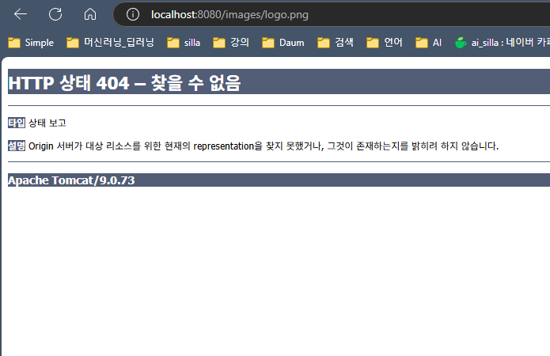
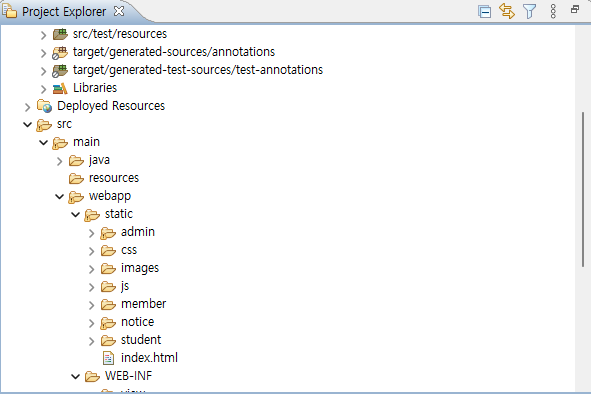

# 강의 10 - 정적파일 서비스하기
> 정적인 리소스(이미지, html, js, css 등)Get 요청은 막혀있음
## 정적인 파일 요청(이미지) 에러
### http://localhost:8080/images/logo.png

> 
## url-mapping의 의미
### <url-pattern>/</url-pattern>
- 정적인 파일의 요청은 막는다., JSP 요청은 가능하다.

### <url-pattern>/*</url-pattern>
- JSP 파일 요청까지 막는다.

### 정적인 파일 요청 설정 방법(개별적 설정)
```xml
<mvc:resources location="/images/" mapping="/images/**" />
<mvc:resources location="/js/" mapping="/js/**" />
<mvc:resources location="/css/" mapping="/css/**" />
```
### 정적인 파일 요청 설정 방법(통합적 설정)
```xml
<mvc:resources location="/static/" mapping="/**" />
스프링부트와의 호환을 위해서 주로 사용됨

또는
<mvc:resources location="/public/" mapping="/**" />

<mvc:resources location="/resource/" mapping="/resource/**" />
** 현재는 잘 사용되지 않음
```

## 최종 설정 파일 및 폴더 구성
```xml
<?xml version="1.0" encoding="UTF-8"?>
<beans xmlns="http://www.springframework.org/schema/beans"
    xmlns:mvc="http://www.springframework.org/schema/mvc"
    xmlns:xsi="http://www.w3.org/2001/XMLSchema-instance"
    xsi:schemaLocation="http://www.springframework.org/schema/beans
        https://www.springframework.org/schema/beans/spring-beans.xsd
        http://www.springframework.org/schema/mvc
        https://www.springframework.org/schema/mvc/spring-mvc.xsd">

	<!-- <bean id="url 매핑" class="...">   -->
    
    <bean id="/index" class="com.simple.web.controller.IndexController" />  
    
    <bean class="org.springframework.web.servlet.view.InternalResourceViewResolver">
    	<property name="prefix" value="/WEB-INF/view/"></property>
    	<property name="suffix" value=".jsp"></property>
    </bean>    
    
    <mvc:resources location="/static/" mapping="/**"></mvc:resources>
</beans>
```


> **결론적으로 모든 리소스 파일의 경로는 "static"경로에서 검색되도록 한다.**
