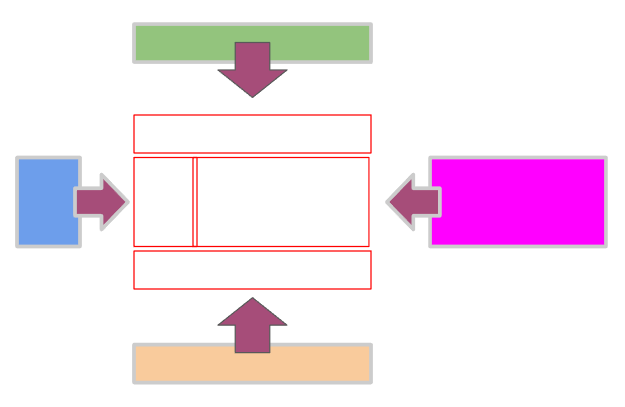

# 15 - Tiles 지시서 작성하기
> Controller 호출--> 데이터 작업 --->  뷰 호출(list.jsp)
> 추가적인 뷰처리(분리된 공통 페이지(header, footer, visual, aside, 등등) 삽입 기능--> tiles)
## tiles 공통페이지 조립 기능


## tile 처리를 위한 설정
- 뷰처리시 tiles를 위한 호출 명칭 설정
- 공통페이지를 어디에 설정할 것인가?
- 참고 사이트 : [https://attic.apache.org/projects/tiles.html](https://tiles.apache.org/framework/tutorial/basic/pages.html)
- 최근 추세는 더 이상 백엔드에서 페이지 처리를 하지 않고 프론트 엔드에 페이지 처리를 한다.
- 규모가 큰 경우에는 여전히 백엔드에서 페이지 처리를 하고 있다.
## tiles sample 설정
```xml
<?xml version="1.0" encoding="ISO-8859-1" ?>
<!DOCTYPE tiles-definitions PUBLIC
       "-//Apache Software Foundation//DTD Tiles Configuration 3.0//EN"
       "http://tiles.apache.org/dtds/tiles-config_3_0.dtd">
<tiles-definitions>
  <definition name="myapp.homepage" template="/layouts/classic.jsp">
    <put-attribute name="title" value="Tiles tutorial homepage" />
    <put-attribute name="header" value="/tiles/banner.jsp" />
    <put-attribute name="menu" value="/tiles/common_menu.jsp" />
    <put-attribute name="body" value="/tiles/home_body.jsp" />
    <put-attribute name="footer" value="/tiles/credits.jsp" />
  </definition>
</tiles-definitions>
```
> 위의 설정 파일은 "/WEB-INF/tiles.xml"에 저장한다.


