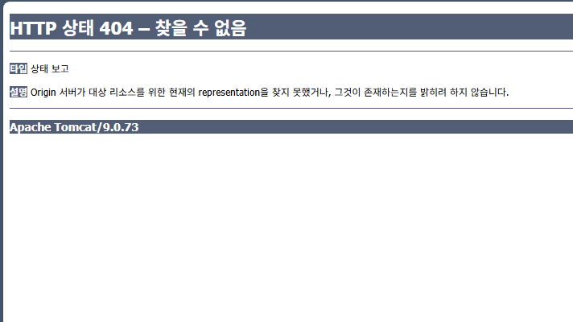

# 스프링 빈 설정 파일 다루기

> https://docs.spring.io/spring-framework/docs/
- https://docs.spring.io/spring-framework/docs/5.2.x/spring-framework-reference/core.html#spring-core
## Controll 클래스 URL 매핑 설정
> dispatcher-servlet.xml 파일
```xml
<?xml version="1.0" encoding="UTF-8"?>
<beans xmlns="http://www.springframework.org/schema/beans"
    xmlns:xsi="http://www.w3.org/2001/XMLSchema-instance"
    xsi:schemaLocation="http://www.springframework.org/schema/beans
        https://www.springframework.org/schema/beans/spring-beans.xsd">

	<!-- <bean id="url 매핑" class="...">   -->
    
    <bean id="/index" class="com.simple.web.controller.IndexController">  
    </bean>
</beans>
```

## Controller 코드 작성
```java
package com.simple.web.controller;

import javax.servlet.http.HttpServletRequest;
import javax.servlet.http.HttpServletResponse;

import org.springframework.web.servlet.ModelAndView;
import org.springframework.web.servlet.mvc.Controller;

// 소스가 없으므로 설정파일(dispatcher-servlet.xml)에서 컨트롤러 클래스의 URL매핑한다.
public class IndexController implements Controller{

	@Override
	public ModelAndView handleRequest(HttpServletRequest request, HttpServletResponse response) throws Exception {
		// TODO Auto-generated method stub
		
		ModelAndView mv = new ModelAndView();
		mv.addObject("data","Hello Spring MVC~~ ");
		mv.setViewName("index.jsp");
		
		return mv;		
	}	
}
```
### 404 에러
> Origin 서버가 대상 리소스를 위한 현재의 representation을 찾지 못했거나, 그것이 존재하는지를 밝히려 하지 않습니다.


