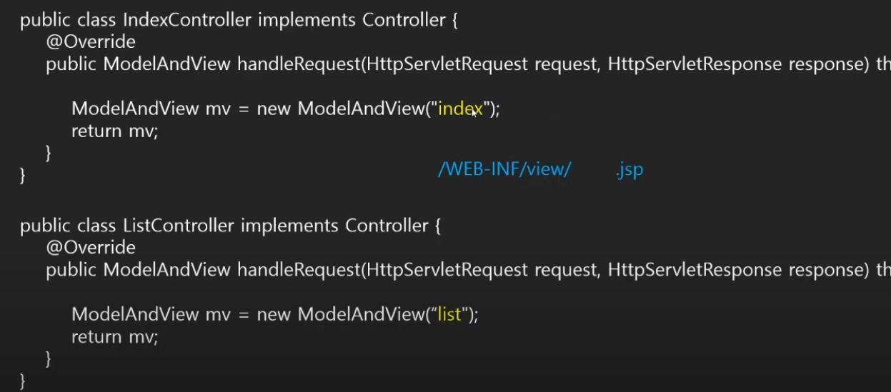

# ViewResolver 사용하기
## ViewResolver란
> View페이지 접근을 위한 경로 및 뷰처리 언어의 확장자를 관리하는 기능을 제공한다.


## dispatcher-servlet.xml 설정파일 추가
```xml
<bean class="org.springframework.web.servlet.view.InternalResourceViewResolver">
    	<property name="prefix" value="/WEB-INF/view/"></property>
    	<property name="suffix" value=".jsp"></property>
</bean>
```
